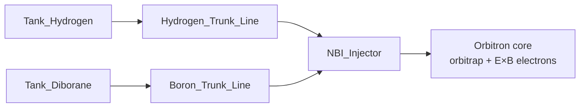

# Orbitron lab — gas flow (p-¹¹B Orbitron, Avalanche-class core)

**Core physics:** [`ssto/orbitron/assembly_specs/orbitron_avalanche_core.yaml`](ssto/orbitron/assembly_specs/orbitron_avalanche_core.yaml) — same Orbitron as Avalanche’s D₂ machine; **p-¹¹B** fueling is the unobtainium leap.

**Meshes / tree:** [`ssto/orbitron/assembly_specs/orbitron_lab.yaml`](ssto/orbitron/assembly_specs/orbitron_lab.yaml)

**Axis:** propulsion **−X → +X**; tank farm **+Y**.

---

## Summary

| Fluid | Route | Core p-¹¹B? |
|--------|--------|----------------|
| **H₂** | `Tank_Hydrogen` → `Hydrogen_Trunk_Line` → `NBI_Injector` | **Yes** (protons / stability) |
| **B₂H₆** | `Tank_Diborane` → `Boron_Trunk_Line` → `NBI_Injector` | **Yes** (boron carrier) |
| **⁴He ash** | `Fusion_Hot_Gas_Outlet` → `Helium_Ash_Vent_Line` → nozzle | **Yes** (fusion product) |
| **Air** | Intake → annulus → detuner → nozzle | SSTO energy offload |
| **CH₄** | Cryo dewar → magnet rim | SSTO wall thermal only |

**Headline channel (in plasma):** ``¹H + ¹¹B → 3 ⁴He``

---

## 1. Tangential keV injectants (core)

Same **tangential injection** and **cathode-pulse stability** as a D₂ Orbitron; species are H⁺/B⁺ after ionization, not D⁺.

**Controls:** W/S ion beam mA · I/K cathode pulse · U/J compressor (air path).

---

## 2. Helium ash (fusion product)

⁴He from p-¹¹B vents through `Helium_Ash_Vent_Line` into `Nozzle_Inlet_Plenum` — **not** from `Tank_Hydrogen`.

---

## 3. Air + optional SSTO services

- **Air** — arcjet / nozzle thermodynamic offload.  
- **CH₄** — optional SSTO anode cooling (`methane_tank_assy`).  
- **DEC** — optional SSTO power tap (`ssto_flight_article_addons`).

---

## Build

`make orbitron-lab-gltf` → `hydrogen_tank_assy.gltf`, `boron_tank_assy.gltf`, full lab.
