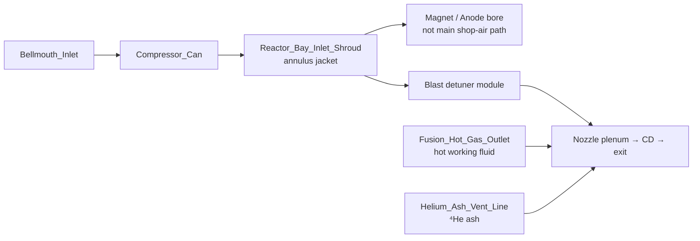

# Orbitron lab — gas flow design

Authoritative machine-readable spec: [`ssto/orbitron/assembly_specs/orbitron_lab.yaml`](ssto/orbitron/assembly_specs/orbitron_lab.yaml) (geometry, logical tree, `connections`).  
This document is the human-readable record of **what moves where** in the test-stand narrative.

**Lab axis convention:** propulsive flow and hot gas run roughly **−X → +X** (intake at −X, nozzle exhaust at +X). Tank farm sits at **+Y**.

---

## Summary table

| Fluid | Source | Primary route | Role |
|--------|--------|---------------|------|
| **Air** | Atmosphere (`Bellmouth_Inlet`) | Annulus / bypass duct → blast detuner → **CD nozzle**; separate **fusion hot-gas** leg | Propulsion, energy offload |
| **B₂H₆** | `Tank_Diborane` | `Pipe_B2H6_Feed` → `Boron_Trunk_Line` → magnet / NBI | Gaseous **boron carrier** (p-¹¹B) |
| **H₂** | `Tank_Hydrogen` | `Pipe_H2_Feed` → `Hydrogen_Trunk_Line` → magnet / NBI | **NBI co-injectant**, proton inventory |
| **CH₄** (liquid) | `Tank_Cryo_Methane` | `Pipe_CH4_Feed` → `Cryo_Methane_Piping` → magnet rim tap | **Anode / wall thermal** management |
| **⁴He** (ash) | Fusion core (product) | `Fusion_Hot_Gas_Outlet` → `Helium_Ash_Vent_Line` → `Nozzle_Inlet_Plenum` | **Fusion ash** into jet / nozzle mix |

**Naming fix (2026):** the red cylinder assembly is **`hydrogen_tank_assy`** (H₂ injectant). It is **not** a bottled helium supply. True **helium** in this plant is **⁴He ash** produced in the reactor and vented through **`Helium_Ash_Vent_Line`**.

---

## 1. Air (propulsive / air-breathing path)

Logical group: `air_breathing_engine` (`turbofan_intake` → `reactor_bay` → `propulsive_nozzle`).

1. **Bellmouth (−X)** — ram / turbofan-style inlet.  
2. **Compressor** — discharge into the **outer annulus jacket**, not as the primary flow through the plasma bore.  
3. **Reactor bay inlet shroud** — working air around the solenoid / pressure boundary.  
4. **Blast detuner** — conditions the **bypass annulus** stream before the nozzle interface.  
5. **Fusion hot gas outlet** — core enthalpy / working fluid into the nozzle train (separate from all bypass air).  
6. **Helium ash vent** — **⁴He** from the fusion channel enters the **same nozzle plenum** (see §5).  
7. **CD nozzle (+X)** — supersonic exhaust; JSBSim **thrust** and **mdot** on the operator screen track this path (compressor + throttle).

---

## 2. Boron (diborane, B₂H₆)

Assembly: `boron_tank_assy`.

| Step | Mesh / connection |
|------|-------------------|
| Storage | `Tank_Diborane` (+Y fuel farm) |
| Tank boss | `Pipe_B2H6_Feed` |
| Trunk | `Boron_Trunk_Line` → magnet farm-face / NBI region |
| In plasma | B₂H₆ dissociates; boron for **¹H + ¹¹B → 3 ⁴He** |
| Schematic | Dotted link toward `DEC_Grid` (coarse CAD only) |

Boron does **not** use the main air annulus as its carrier.

---

## 3. Hydrogen (H₂ injectant)

Assembly: **`hydrogen_tank_assy`** (formerly mislabeled “helium” in export names).

| Step | Mesh / connection |
|------|-------------------|
| Storage | `Tank_Hydrogen` (decal **HYDROGEN**) |
| Tank boss | `Pipe_H2_Feed` |
| Trunk | `Hydrogen_Trunk_Line` → magnet / NBI manifold |
| Role | NBI co-injectant; stability / laminarity; **proton** side of p-¹¹B after dissociation |
| Schematic | Dotted link toward `DEC_Grid` |

This is **stored hydrogen feedstock**, not fusion-product helium.

---

## 4. Methane (liquid CH₄)

Assembly: `methane_tank_assy`.

| Step | Mesh / connection |
|------|-------------------|
| Storage | `Tank_Cryo_Methane` (decal **LIQUID METHANE**) |
| Tank boss | `Pipe_CH4_Feed` |
| Cryo line | `Cryo_Methane_Piping` → magnet high-side / rim tap |
| Role | **Thermal management** (anode / Bremsstrahlung-scale wall heat) |
| Concept | Dotted tie toward `Compressor_Can` (intercooling sketch) |

The redundant **CH₄ leg** on the old combined injectant trunk was **removed**; only this cryo path carries CH₄ in the current spec.

---

## 5. Helium ash (⁴He fusion product)

**Not** from a tank. Produced in the discharge; **vented into the jet nozzle**.

| Step | Mesh / connection |
|------|-------------------|
| Origin | Fusion core — headline channel **¹H + ¹¹B → 3 ⁴He** |
| Bleed point | `Fusion_Hot_Gas_Outlet` (core exhaust plane) |
| Vent line | `Helium_Ash_Vent_Line` (`lab_helium_ash_vent` routing) |
| Destination | `Nozzle_Inlet_Plenum` — joins hot-gas / jet mix |
| Visual | Light blue-grey pipe in glTF (distinct from black H₂ / B₂H₆ trunks) |

Logical YAML `connections`:

- `Fusion_Hot_Gas_Outlet` → `Helium_Ash_Vent_Line` (ash bleed)  
- `Helium_Ash_Vent_Line` → `Nozzle_Inlet_Plenum` (into nozzle)

---

## 6. Sub-assembly glTF exports

| glTF | Contents |
|------|----------|
| `hydrogen_tank_assy.gltf` | H₂ tank + decal + feed + trunk |
| `methane_tank_assy.gltf` | CH₄ dewar + cryo leg |
| `boron_tank_assy.gltf` | B₂H₆ tank + trunk |
| `tank_assy.gltf` | Full farm + skid |
| `air_breathing_engine.gltf` | Air path + reactor bay + nozzle (includes ash vent if in tree) |

Build: `make orbitron-lab-gltf` or `./stand.sh`.

---

## 7. Related docs

- [`ssto/orbitron/assembly_specs/README.md`](ssto/orbitron/assembly_specs/README.md) — spec index, thrust-sled telemetry  
- [`README.md`](README.md) — test-stand purpose and three **supply** gases (B₂H₆, H₂, CH₄)  
- [`ssto/orbitron/assembly_specs/orbitron_physics_surrogate.yaml`](ssto/orbitron/assembly_specs/orbitron_physics_surrogate.yaml) — surrogate + load-cell model (not CFD of these paths)
