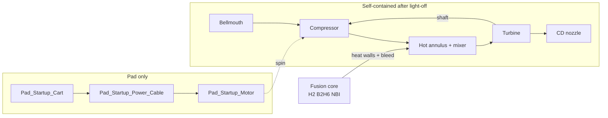

# Orbitron lab — gas & air path (p-¹¹B Orbitron)

**Core plasma:** [`ssto/orbitron/assembly_specs/orbitron_avalanche_core.yaml`](ssto/orbitron/assembly_specs/orbitron_avalanche_core.yaml)

**Reference propulsion plant (mechanism of action):** [`ssto/orbitron/assembly_specs/orbitron_reference_plant.yaml`](ssto/orbitron/assembly_specs/orbitron_reference_plant.yaml)

**Meshes / tree:** [`ssto/orbitron/assembly_specs/orbitron_lab.yaml`](ssto/orbitron/assembly_specs/orbitron_lab.yaml)

**Axis:** propulsion **−X → +X**; tank farm **+Y**.

---

## Dummy-level mechanism (air pushes the plane)

1. **Scoop** (`Bellmouth_Inlet`) captures **air**.
2. **Compressor** (on a **shaft**) raises **pressure** and **mass flow** — air is the **reaction mass**.
3. **Hot section** (annulus around the core + mixer): fusion heats the air by **wall convection** and by **mixing** with hot core exhaust / **⁴He ash** (small mass, large enthalpy).
4. **Turbine** (same shaft) extracts enough **shaft work** to keep the **compressor** spinning after startup.
5. **Nozzle** expands what is left → **high exit velocity** → **thrust**.

Fusion **does not** shove outside air into the plasma. **H₂ / B₂H₆** feed **NBI** only. **CH₄** and **DEC** are optional SSTO add-ons (walls / ship power), not the core thrust story.

---

## Startup (test stand — self-contained after light-off)

| Phase | What happens |
|--------|----------------|
| **Pad APU** | ``Pad_Startup_Cart`` → ``Pad_Startup_Power_Cable`` → ``Pad_Startup_Motor`` (orange pod on −X). Rig only; **not flight weight**. |
| **Spin-up** | Compressor moves air; reactor can ignite. |
| **Heat** | Hot walls + mixer raise gas temperature. |
| **Turbine takeover** | Turbine power ≥ compressor power → **APU off** (clutch out / freewheel). |
| **Run** | Spool + fusion heat + nozzle thrust — **no ongoing off-board power** for the compressor. |

Compressed air alone does **not** self-start the spool on a static rig; you need that first **electric** spin (or a dedicated pneumatic starter — still “APU”).

---

## Heat: where fusion energy enters the air

| Path | Physics | In mesh / story |
|------|---------|-----------------|
| **Wall convection** | Hot anode / magnet / jacket → air in **annulus** | `Reactor_Bay_Inlet_Shroud`, hot `Anode` / `Magnet` |
| **Gas mixing** | Hot core exhaust + ash into **plenum** | `Fusion_Hot_Gas_Outlet`, `Helium_Ash_Vent_Line`, `Nozzle_Inlet_Plenum` |
| **Shaft work** | Turbine drives compressor | `Turbine_Can` on same spool as `Compressor_Can` |

Alphas and other wall loads **heat metal first**; air does not need a “courier” slug of core gas to carry **all** waste heat.

---

## Fluid summary

| Fluid | Route | Core p-¹¹B? |
|--------|--------|----------------|
| **H₂** | `Tank_Hydrogen` → `Hydrogen_Trunk_Line` → `NBI_Injector` | **Yes** |
| **B₂H₆** | `Tank_Diborane` → `Boron_Trunk_Line` → `NBI_Injector` | **Yes** |
| **⁴He ash** | `Fusion_Hot_Gas_Outlet` → `Helium_Ash_Vent_Line` → nozzle plenum | **Yes** (product) |
| **Air** | Bellmouth → compressor → annulus → hot duct → turbine → nozzle | Propulsion |
| **CH₄** | Cryo dewar → magnet service bosses | SSTO wall thermal only |
| **HV** | Console → magnet feedthrough boss | Schematic bus |

**Plasma channel:** ``¹H + ¹¹B → 3 ⁴He``

---

## Plant diagram (single spool)



---

## Controls (FlightGear)

| Key | Property | Meaning |
|-----|----------|---------|
| W/S | `/controls/reactor/throttle` | Ion beam / reactor intensity |
| I/K | `/controls/orbitron/cathode-pulse` | Cathode shear program |
| U/J | `/controls/orbitron/compressor` | **Air-path / shaft-work** command (surrogate) |
| Space | `/sim/model/reactor/startup-trigger` | Reactor active |

---

## Build (do **not** remodel from scratch in Blender)

From repo root:

```bash
./stand.sh          # glTF + orbitron.ac + surrogate + sounds (full runnable FG stand)
```

Preview in Blender only (after `./stand.sh` or `make orbitron-lab-gltf`):

```bash
./bl.sh             # re-import orbitron_lab.gltf (close old Blender scene first)
./bl.sh --collections   # optional VIEW__* layer toggles
```

Pad startup (beside −X intake): **grey** `Pad_Startup_Cart` on the deck, **black** `Pad_Startup_Power_Cable`, **orange** `Pad_Startup_Motor`. Intake train: **blue** `Compressor_Can`, **bronze** `Turbine_Can` on +X. Stale glTF? Rerun `./stand.sh` and `./bl.sh`.
