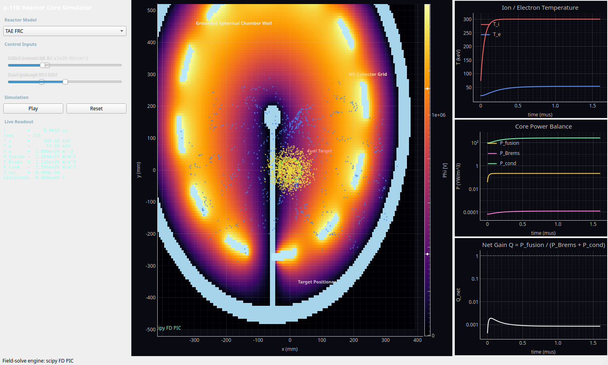
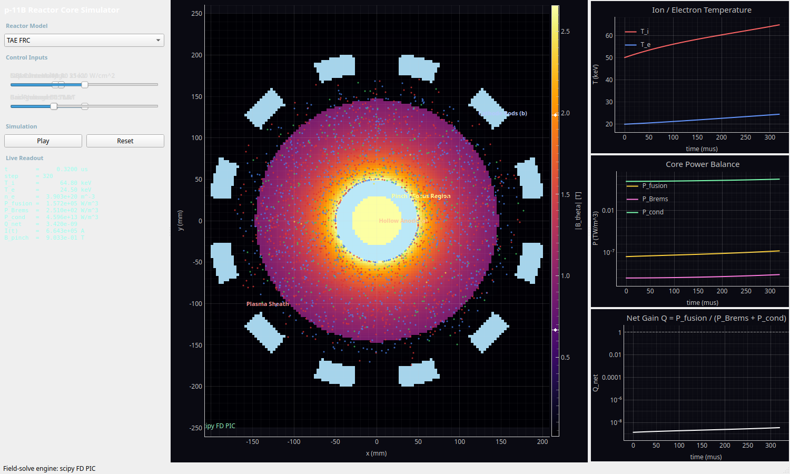

# p-11B Reactor Core Simulator -- Tutorial & Narrative Guide

This guide walks through the dashboard: the universal colored-particle legend,
then a narrative for each of the three reactor concepts (physical architecture,
control inputs, what the particles are doing, and the output measurements).

> Launch with `./pb11_reactor_sim/run.sh`, pick a reactor from the dropdown,
> press **Play**, and drag the sliders. **Reset** restarts the active reactor.

---

## The p-¹¹B reaction is a 4-stage chain (and why that matters here)

It is tempting to write the reaction as a single step, `p + ¹¹B → 3α + 8.7 MeV`.
In reality it is a **sequential decay through short-lived intermediate nuclei**,
and that internal structure is what gives the fusion products their
characteristic energy distribution.

### The four stages

```
  Stage 1: ¹H + ¹¹B  →  ¹²C*                 (fusion forms an excited compound nucleus)
  Stage 2: ¹²C*      →  α  +  ⁸Be(*)         (emits the PRIMARY alpha)
  Stage 3:                ⁸Be(*)             (the recoil nucleus, itself unbound)
  Stage 4:                ⁸Be(*) →  α + α     (breaks up into two SECONDARY alphas)
```

Net result: **3 alphas** sharing the ~8.7 MeV release -- but they are emitted in
**two distinct steps**, so they do not come out with equal energies.

Stage 2/3 actually has two competing branches, depending on which state of ⁸Be
is left behind:

- **α₁ branch (~90%):** `¹²C* → α₁ + ⁸Be*(2⁺, 3.03 MeV) → α₁ + 2α`
- **α₀ branch (~10%):** `¹²C* → α₀ + ⁸Be(0⁺, ground state) → α₀ + 2α`

### Time scales of the intermediates

The intermediate nuclei exist for an extraordinarily short time -- set by their
quantum level width via `τ = ℏ / Γ`:

| Intermediate | Decays to | Width Γ | Lifetime τ = ℏ/Γ |
|---|---|---|---|
| **¹²C\*** (compound nucleus, ~16.6 MeV) | α + ⁸Be | ~0.3 MeV | **~10⁻²¹ – 10⁻¹⁸ s** |
| **⁸Be\*** (2⁺, 3.03 MeV) | 2α | ~1.5 MeV | **~4×10⁻²² s** |
| **⁸Be** (0⁺ ground state) | 2α | 5.57 eV | **~8×10⁻¹⁷ s** |

Even the longest-lived of these (⁸Be ground state, ~10⁻¹⁶ s) decays about
50,000× faster than the shortest simulation timestep (HB11's `dt = 5 ps`), and
travels only a fraction of a nanometre before breaking up. **So the simulator
does not transport ¹²C\* or ⁸Be as particles at all** -- treating the reaction
as instantaneous (`p + ¹¹B → 3α`) is fully justified, not a shortcut. What the
simulator *does* keep is the kinematic fingerprint those stages leave on the
alphas.

### The alpha energy distribution

Because the primary alpha (Stage 2) and the two secondary alphas (Stage 4) are
born from different two-body decays, they populate different energy ranges. The
aggregate per-alpha spectrum is modeled as a **weighted sum of Gaussians**, one
per emitted-alpha population:

```
f(E) = Σ_k  w_k · N(E ; μ_k, σ_k)
```

| Component (k) | Origin | μ_k [MeV] | σ_k [MeV] | weight w_k |
|---|---|---|---|---|
| α₁ primary    | Stage 2, α₁ branch | 3.76 | 0.30 | 0.90 × 1/3 |
| α₁ secondary  | Stage 4, ⁸Be\*(3.03) breakup | 2.46 | 1.00 | 0.90 × 2/3 |
| α₀ primary    | Stage 2, α₀ branch | 5.70 | 0.30 | 0.10 × 1/3 |
| α₀ secondary  | Stage 4, ⁸Be(g.s.) breakup | 1.43 | 0.50 | 0.10 × 2/3 |

The weights are normalized to 1; the `1/3 : 2/3` split reflects one primary plus
two secondary alphas per reaction. By construction the mean alpha energy is

```
⟨E_α⟩ = Σ_k w_k μ_k ≈ 2.89 MeV    ⇒    3 ⟨E_α⟩ ≈ 8.7 MeV
```

so the total released energy is conserved on average, while individual alphas
range from ~0 to ~6.8 MeV with the well-known broad peak near ~3.8 MeV. This is
implemented in [`physics/processes.py`](physics/processes.py) as
`sample_alpha_energies_J(n, rng)`.

### Why representing the distribution improves fidelity

The whole point of p-¹¹B is **direct energy conversion** of the charged alphas
to electricity (TAE's ICC, HB11's electrostatic collector grid). A direct
converter is an *energy filter*: a decelerating potential `V` turns back any
alpha whose kinetic energy is below `2eV` and collects the rest. If every alpha
had the same energy `8.7/3 ≈ 2.9 MeV`, the converter response would be an
unphysical step function -- all-or-nothing at one grid voltage.

With the real spectrum, the model behaves like the real machine:

- **Energetic primary alphas (~3.8–5.7 MeV)** punch through higher decelerating
  potentials -- so HB11's `Collected` charge and TAE's `ICC sig` keep responding
  as you raise the grid voltage toward 3 MV.
- **Soft ⁸Be-breakup secondaries (~1–2.5 MeV)** are turned back at lower
  voltages, shaping the collection-efficiency-vs-voltage curve.

In short: modeling the 4-stage chain lets the **direct-conversion diagnostics
respond to a voltage sweep the way a real collector would**, which is exactly
the engineering question these reactors are built to answer.

---

## The colored dots (macroparticles)

Every reactor renders live **macroparticles** -- each dot represents a large
swarm of real particles (a "macroparticle weight") so that millions of physical
particles can be visualized with a few thousand dots. The color encodes the
species, and the color key is identical across all three reactors:

| Color | Species | Charge | What it represents |
|-------|---------|--------|--------------------|
| **Red** | Proton (`p`, ¹H) | +1e | The light fuel ion. |
| **Green** | Boron-11 (`B`, ¹¹B) | +5e | The heavy fuel ion (Z = 5 -- the big Bremsstrahlung driver). |
| **Yellow** | Alpha (`α`, ⁴He) | +2e | Fusion *product*. Each p-¹¹B reaction makes 3 alphas sharing 8.7 MeV. |
| **Blue** | Electron (`e`) | −1e | Neutralizing electrons; their temperature `T_e` sets the radiation losses. |

Reading the motion:
- **Red + Green** dots are the reacting fuel. Where they overlap densely and are
  hot, fusion happens.
- **Yellow** dots *appear over time* -- they are born from fusion events and then
  stream toward a collector (TAE/HB11) or out of the pinch (LPP). Watching yellow
  accumulate is watching the reactor produce energy.
- **Blue** dots track the electron cloud. In the aneutronic concepts the whole
  game is keeping the blue population *colder* than the fuel ions.

The bright **cyan/white shapes** are not particles -- they are the **solid
conductor structures** (walls, electrodes, grids, targets), drawn as
high-contrast overlays and labeled with text.

> The yellow alphas are **not** monoenergetic -- they are sampled from the real
> p-¹¹B energy spectrum produced by the 4-stage decay chain described at the top
> of this guide. That is why the direct-conversion diagnostics (TAE `ICC sig`,
> HB11 `Collected` charge) respond realistically to a grid-voltage sweep.

---

## Universal output measurements (right-hand diagnostic panel)

All three reactors report the same coupled core-process equations, evaluated
every timestep. These feed the three linked real-time plots and the "Live
Readout" text box on the left.

1. **Ion / Electron Temperature** (`T_i`, `T_e`, in keV) -- the top plot.
   The central tension of p-¹¹B: ion temperature must reach ~150-300 keV for
   fusion, while electron temperature should stay low to limit radiation.

2. **Core Power Balance** (W/m³, log scale) -- the middle plot:
   - `P_fusion = n_p n_B ⟨σv⟩ E_f` with `E_f = 8.7 MeV` (yellow).
   - `P_Brems` = relativistic Bremsstrahlung radiation loss (pink):
     `1.57e-40 · Z_eff² · n_e² · √T_e · (1 + 1.71 T_e/m_e c²)`.
   - `P_cond` = conductive/transport energy loss `3 n_e T_e / τ_E` (green).

3. **Net Gain `Q`** (log scale) -- the bottom plot:
   `Q = P_fusion / (P_Brems + P_cond)`. The dashed line marks `Q = 1`
   (scientific breakeven). For thermal p-¹¹B this sits stubbornly below 1 --
   that is the famous **Rider limit**, and it is *supposed* to be hard.

Each reactor also adds a couple of **machine-specific readouts** in the Live
Readout box (described per reactor below).

---

## 1. TAE FRC -- Field-Reversed Configuration


### Physical architecture being modeled
A **2D slice along the machine axis** of a cylindrical confinement chamber. The
horizontal axis `x` is the machine axis; the vertical axis `y` runs across the
field-reversal plane. A solid **cylindrical conducting wall** (the cyan border)
encloses the plasma. At the far +x end sits the **Inverse Cyclotron Converter
(ICC)** -- a stack of **segmented collector electrodes**.

The displayed field colormap is the **FRC axial magnetic field**:
`B_z(y) = B0 · tanh(y / y_s)`. You can see it as a vertical gradient -- bright
(positive `B_z`) at the top, dark (negative `B_z`) at the bottom, with the
**field-reversal plane (`B_z = 0`)** running through the middle in red/orange.
The plasma density follows `n(y) = n0 · sech²(y / y_s)`, peaked on that midplane.

The ICC physics is the key innovation: fusion **alphas (yellow)** stream axially
toward +x, pass the segmented electrodes, and induce an **alternating current**
as their image charge hops segment to segment -- i.e. direct conversion of
charged-particle energy to AC electricity, no steam cycle.

### Control inputs (sliders)
| Slider | Range | Default | Effect |
|--------|-------|---------|--------|
| **NBI Current** | 0-120 A | 40 A | Neutral Beam Injection. Higher current injects more fast protons (you will see red dots stream in from the left) and heats the ions, raising `T_i`. |
| **Background B0** | 0.1-5.0 T | 1.5 T | Sets the FRC field strength `tanh` amplitude. Higher `B0` improves confinement (longer `τ_E`), steepens the field gradient, and tightens the gyro-orbits. |

### What the dots do
Red/green/blue fuel and electrons **gyrate** in the `B_z` field (Boris pusher),
concentrated near the midplane by the `sech²` profile. NBI continuously injects
fast red protons from the left wall. Yellow alphas are born near the core and
drift toward the +x ICC, where they are collected.

### Machine-specific readout
- **`ICC sig`** -- the instantaneous induced AC pickup signal (arbitrary units)
  from alphas crossing the collector segments. This oscillates -- it is your
  direct-conversion output waveform.

---

## 2. HB11 Laser -- Laser-Driven Block Ignition



### Physical architecture being modeled
A **2D slice through a spherical reaction chamber**. The outer cyan ring is the
**grounded spherical chamber wall**. A small solid **fuel target** sits at the
center on a thin **target positioner** stalk. Surrounding the target is a
**high-voltage spherical collector grid** -- drawn as the dashed cyan arcs
(it is a *grid*, with gaps, so particles can pass while it holds a high bias).

The displayed field colormap is the **electrostatic potential `Φ`**, obtained by
solving Poisson's equation `∇²Φ = −ρ/ε₀` with the grid pinned at the slider
voltage. You can see the potential well/hill the grid creates.

Two physics processes drive it:
- **Ponderomotive block acceleration:** a localized 2D Gaussian laser pulse
  hits the target and ejects fuel via the ponderomotive force
  `F_p = −(e²/4 m_e ω²) ∇⟨E²⟩`. On picosecond timescales the ions are pushed
  out as a directed "block" before electrons can thermalize -- this is how HB11
  tries to beat the Rider limit (note `T_e` stays much lower than `T_i`).
- **Electrostatic deceleration / direct collection:** outward ions climb the
  grid's potential, are decelerated, and their charge is **collected on the
  grid** as DC current.

### Control inputs (sliders)
| Slider | Range | Default | Effect |
|--------|-------|---------|--------|
| **Laser Intensity** | 1-100 (×10²⁰ W/cm²) | 30 | Strength of the ponderomotive drive. Higher intensity ejects the fuel block harder and drives `T_i` up toward ~300+ keV. |
| **Grid Voltage** | 0-3 MV | 1.5 MV | Bias on the collector grid. Higher voltage decelerates the escaping ions more strongly and collects more charge (the potential field colormap deepens). |

### What the dots do
A cold fuel **block** (red protons + green boron, with blue electrons) starts as
a thin shell on the target. The laser blows it outward; ions decelerate against
the grid potential and are collected. Yellow alphas appear from fusion in the
compressed core and radiate outward. The block is replenished so the run
sustains.

### Machine-specific readout
- **`Collected`** -- total DC charge (Coulombs) accumulated on the collector
  grid. This is the direct-conversion energy harvest.

---

## 3. LPP DPF -- Dense Plasma Focus



### Physical architecture being modeled
A **2D cross-section perpendicular to the electrode axis** of a coaxial gun.
At the center is the **hollow anode** (inner radius `a`); around the outside is
a ring of **cathode rods** at radius `b` (the cyan blocks). A capacitor bank
discharges across them, forming a **plasma sheath** that is driven inward and
collapses onto the axis as a dense **pinch/focus**.

The displayed field colormap is the **azimuthal magnetic field magnitude**
`|B_θ| = μ₀ I / (2π r)` -- brightest at the center where the current pinches,
falling off as `1/r` outward. Two physics processes drive it:
- **Snowplow sheath dynamics:** the sheath position is integrated from
  `d/dt(M(z) · dz/dt) = μ₀ I(t)² / (4π) · ln(b/a)`, with a ringing RLC current
  `I(t)` set by the capacitor voltage and a swept mass set by the gas pressure.
- **Quantum Magnetic Bremsstrahlung Suppression:** when the pinch field exceeds
  `B_crit = 10⁵ T`, radiation is suppressed by `P_Br · exp(−B/B_crit)`. (At
  realistic DPF currents the field stays well below this extreme threshold, so
  the hook is present but rarely triggers -- as in reality.)

### Control inputs (sliders)
| Slider | Range | Default | Effect |
|--------|-------|---------|--------|
| **Capacitor Voltage** | 10-60 kV | 35 kV | Peak bank current (mega-ampere class). Higher voltage means stronger drive, a tighter/hotter pinch, larger `|B_θ|`, and higher `T_i`. |
| **Gas Pressure** | 0.5-20 Torr | 6 Torr | Fill pressure of the H-B mixture. Sets the swept mass (snowplow inertia) and the plasma density `n_e`. |

### What the dots do
Red/green fuel ions and blue electrons fill the inter-electrode gap and are swept
**inward** with the collapsing sheath (you can watch them migrate toward the axis
as `I(t)` rings up). Ions reflect off the anode surface and are absorbed at the
cathode radius. Yellow alphas are produced in the dense pinch.

### Machine-specific readouts
- **`I(t)`** -- the instantaneous bank current (Amps).
- **`B_pinch`** -- the peak azimuthal field at the collapsing sheath (Tesla).
  Watch this rise as the sheath radius shrinks toward the anode.

---

## Suggested first experiments

1. **TAE FRC:** start at defaults, press Play, and raise **NBI Current** to ~100 A.
   Watch `T_i` climb on the top plot and red beam ions stream in from the left.
   Then raise **B0** and note the tighter gyro-orbits and improved confinement.

2. **HB11 Laser:** crank **Laser Intensity** to ~80 and watch the fuel block
   explode outward while `T_i` rockets toward 300 keV but `T_e` stays low (the
   non-thermal advantage). Raise **Grid Voltage** to 3 MV and watch `Collected`
   charge grow in the readout.

3. **LPP DPF:** raise **Capacitor Voltage** to 60 kV and watch `I(t)` and
   `B_pinch` grow and the central `|B_θ|` colormap brighten as the sheath
   collapses. Lower the **Gas Pressure** to make the lighter sheath collapse
   faster.

In every case, glance at the **`Q_net`** plot. Seeing it sit below the `Q = 1`
line is the whole point of p-¹¹B research -- this simulator lets you feel, in
real time, exactly how hard aneutronic breakeven is and which knobs move it.
